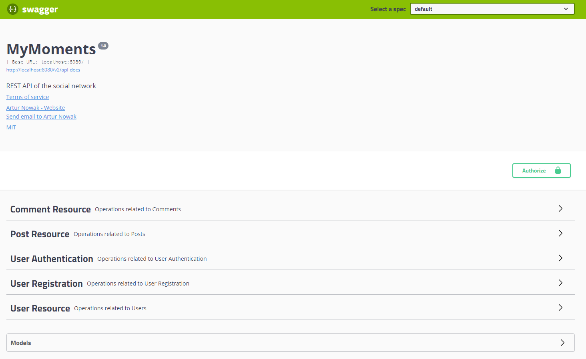
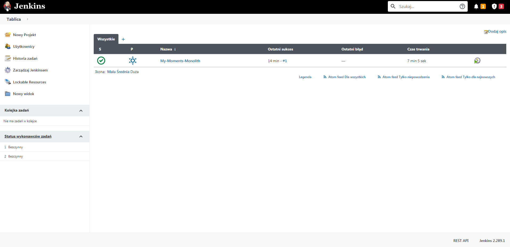

# MyMoments

## Table of Contents

- [General info](#general-info)
- [Demo](#demo)
- [Setup](#setup)
- [Built With](#built-with)
- [Features](#features)
- [Endpoints List](#endpoints-list)
- [Status](#status)
- [Screenshots](#screenshots)

## General info

REST API created while writing the thesis entitled: "Functionality problems of monolitical architecture and microservices in web applications". Version in microservices architecture: https://github.com/NowakArtur97/My-Moments-Microservices.

## Demo

The application demo is available on the Heroku platform: https://my-moments-monolith.herokuapp.com/swagger-ui.html.<br/>
It may take a while for the application to start.

To access the endpoints you must have an account. You can use the previously prepared account:

```json
# POST /api/v1/authentication
# Content-Type: application/json
{
"username": "user",
"password": "user"
}
```

## Setup

### REST API

To start the application, in the folder, enter the following commands in command line:

- `gradle build -x test -Dspring.profiles.active=dev`
- `docker-compose up -d`
  Go to: `http://YOUR_DOCKER_IP_OR_LOCALHOST:8088/swagger-ui.html`, where `YOUR_DOCKER_IP` is your docker machine IP
  address (or localhost). To shut down the containers enter:
- `docker-compose down`

For a development use commands:

- `docker-compose -f docker-compose.dev.yml up -d`
- `docker-compose -f docker-compose.dev.yml down`

Use the login details provided above to generate the token:

```json
# POST /api/v1/authentication
# Content-Type: application/json
{
"username": "user",
"password": "user"
}
```

or create new account by sending the appropriate request (the profile object and image are optional):

```json
# POST /api/v1/registration
# Content-Type: application/json
{
"username": "newUser",
"password": "Password1!",
"matchingPassword": "Password1!",
"email": "email@something.com",
"profile": {
"about": "profile description",
"gender": "UNSPECIFIED",
"interests": "user interests",
"languages":"user languages",
"location": "user's location"
  }
}
```

The password must meet the following requirements:

- Must be between 6 and 30 characters long
- Passwords must match
- Mustn't contain the username
- Mustn't contain spaces
- Mustn't contain a repetitive string of characters longer than 3 characters
- Mustn't be on the list of popular passwords
- Must contain 1 or more uppercase characters
- Must contain 1 or more lowercase characters
- Must contain 1 or more special characters

Then generate JWT. The token can be generated using a username or email address. Password is required.

```json
# POST /api/v1/authentication
# Content-Type: application/json
{
"username": "newUser",
"password": "Password1!"
}
```

Then use the token as a Bearer Token using e.g. Postman or Swagger on `/swagger-ui.html` endpoint.

### Jenkins

In order to deploy on Heroku, you need to add two environment variables: `HEROKU_API_KEY` and `HEROKU_APP_NAME`. The first one is the API key that can be found in the account settings. The second is the name of the app created on Heroku.

Then, in the `./Jenkins/Dockerfile` file, replace the variables: `YOUR_HEROKU_API_KEY` and `YOUR_HEROKU_APP_NAME` with the appropriate data.

A PostgreSQL instance is also required to test the application. To run Jenkins and PostgreSQL, use the `docker-compose.ci.yml` file with command: `docker-compose -f docker-compose.ci.yml up`.

## Built With

- Java 11
- Spring (Boot, MVC, Security, Data JPA) - 2.4.2
- Swagger (Core, Bean Validators, UI) - 2.92
- Flyway - 7.11.0
- Lombok - 1.18.16
- jUnit5 - 5.7.2
- Mockito - 3.8.0
- Model Mapper - 2.4.0
- JSON Web Token Support For The JVM (jjwt) - 0.9.1
- Passay - 1.6.0
- Gradle - 6.8
- MySQL
- PostgreSQL
- Jenkins
- Docker
- Heroku

## Features

- User registration
- JWT authorization
- Users endpoint (GET, PUT, DELETE)
- Posts endpoint (GET, POST, PUT, DELETE)
- Comments endpoint (POST, PUT, DELETE)
- Documentation created using Swagger 2
- Custom password validation
- Database migrations with Flyway
- Continuous deployment with Jenkins
- Automatic plugins installation, job building, user and environment variables creation with Jenkins
- Deployment on Heroku

## Endpoints List:

### Security

| Method | URI                      | Action                                |
| ------ | ------------------------ | ------------------------------------- |
| `POST` | `/api/v1/registration`   | `Create an account`    |
| `POST` | `/api/v1/authentication` | `Generate a JWT`                        |

### Users

| Method    | URI                          | Action                                                               |
| --------- | ---------------------------- | -------------------------------------------------------------------- |
| `GET`     | `/api/v1/users/me/posts` | `Get user's posts`                     |
| `GET`     | `/api/v1/users/{id}/posts`        | `Get user's posts by user's id`
| `PUT`     | `/api/v1/users/me`        | `Update user information`                                      |
| `DELETE`     | `/api/v1/users/me`        | `Delete user`                                      |

### Posts

Note: adding multiple photos to a Post is only possible with tools like Postman, because Swagger doesn't support adding multiple files at once in multipart/form-data format!

| Method    | URI                          | Action                                                               |
| --------- | ---------------------------- | -------------------------------------------------------------------- |
| `GET`     | `/api/v1/posts/{id}` | `Get information about a post`                     |
| `POST`     | `/api/v1/posts`        | `Create a post`
| `PUT`     | `/api/v1/posts/{id}`        | `Update post information`                                      |
| `DELETE`     | `/api/v1/posts/{id}`        | `Delete post with related comments`                                      |

### Comments

| Method    | URI                          | Action                                                               |
| --------- | ---------------------------- | -------------------------------------------------------------------- |
| `POST`     | `/api/v1/posts/{postId}/comments`        | `Add a comment to the post`
| `PUT`     | `/api/v1/posts/{postId}/comments/{commentId}`        | `Update the comment content`                                      |
| `DELETE`     | `/api/v1/posts/{postId}/comments/{commentId}`        | `Delete comment`                                      |

## Status

Project is: finished

## Screenshots



Documentation using Swagger 2



Continuous deployment using Jenkins